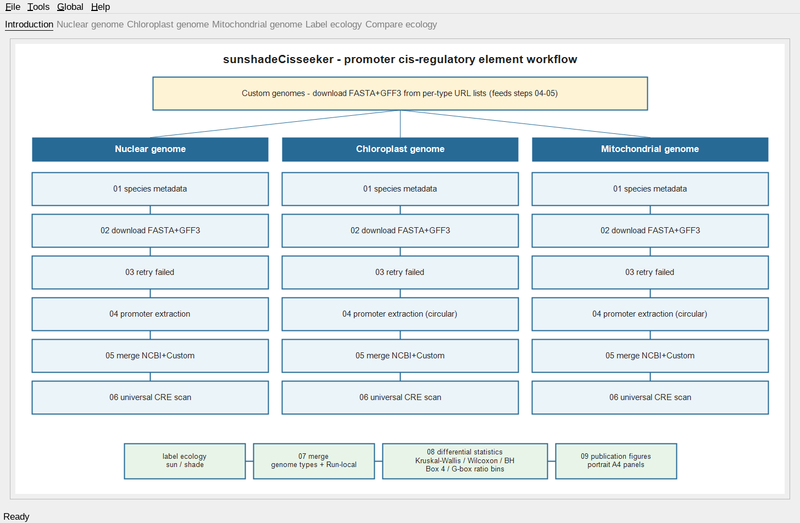
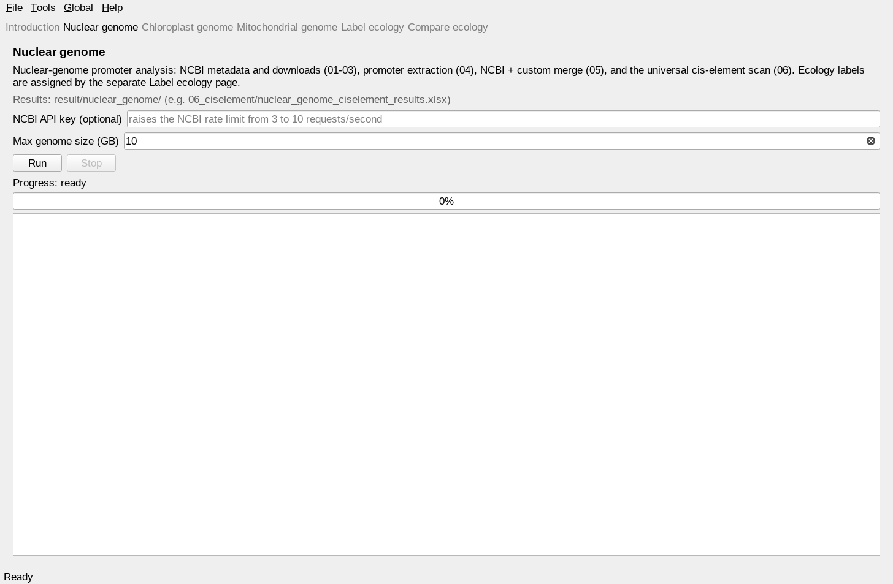
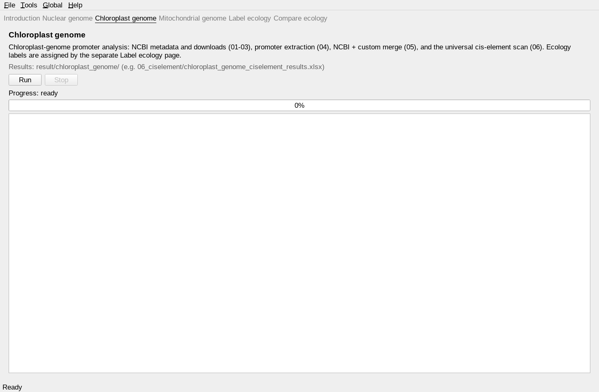
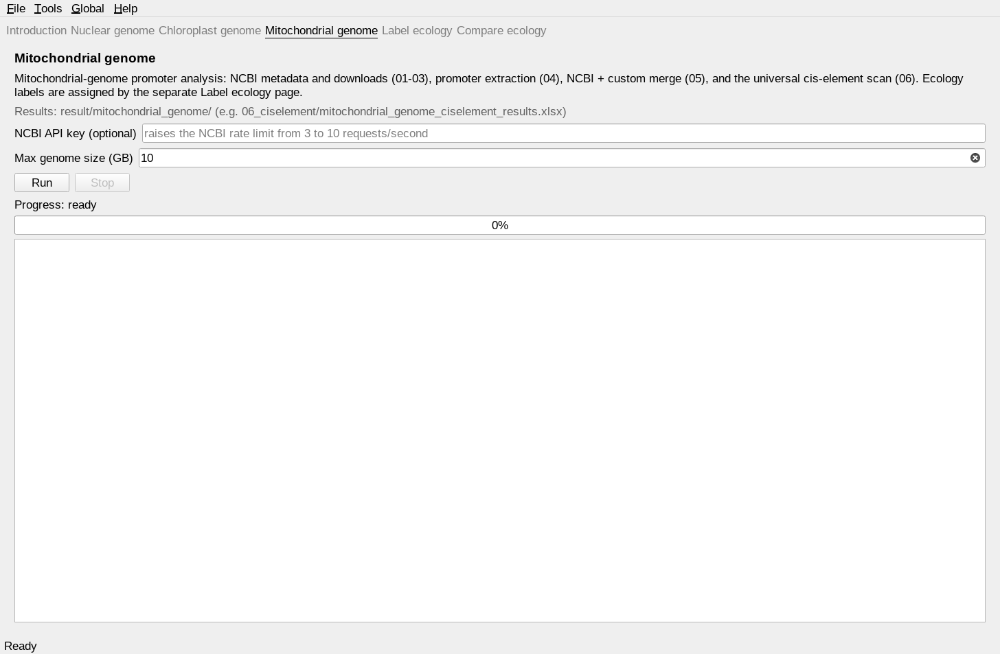
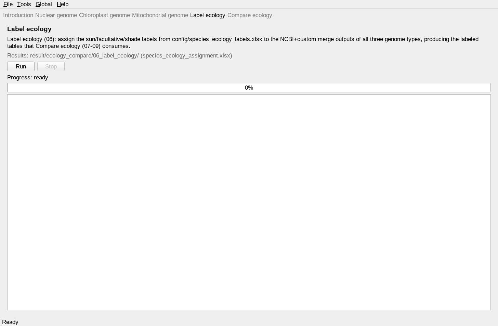
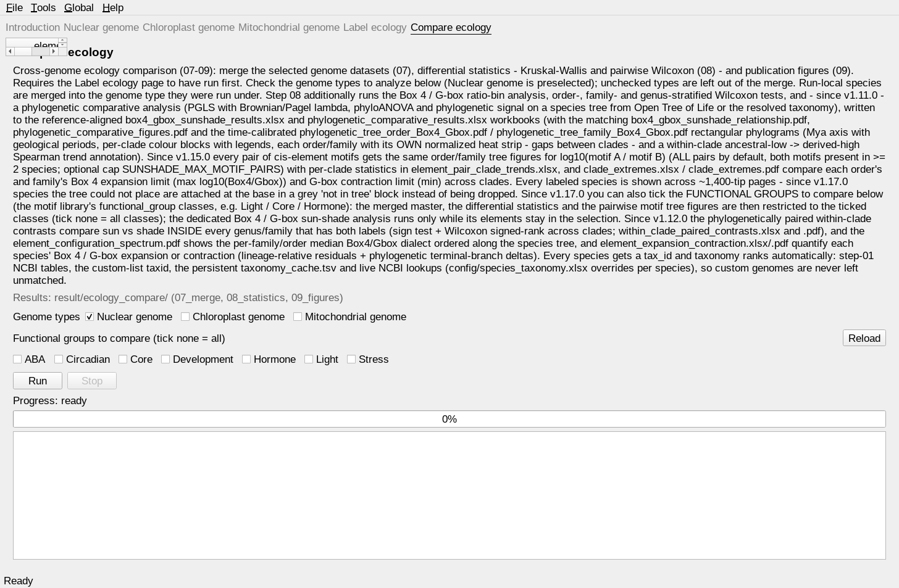
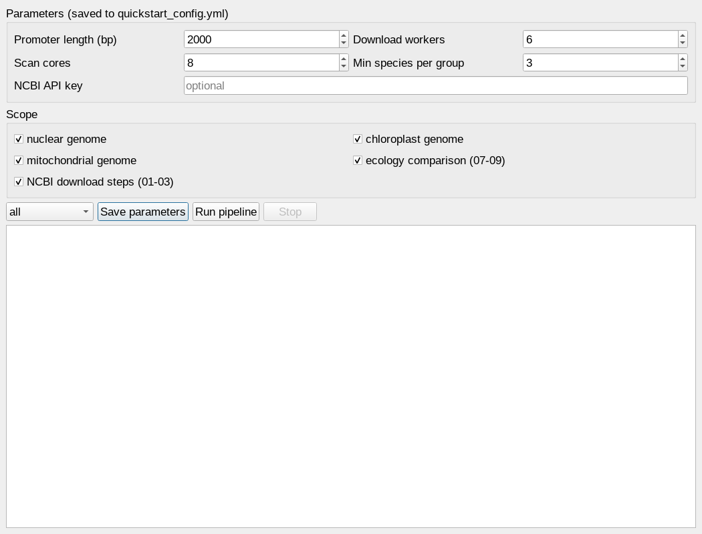
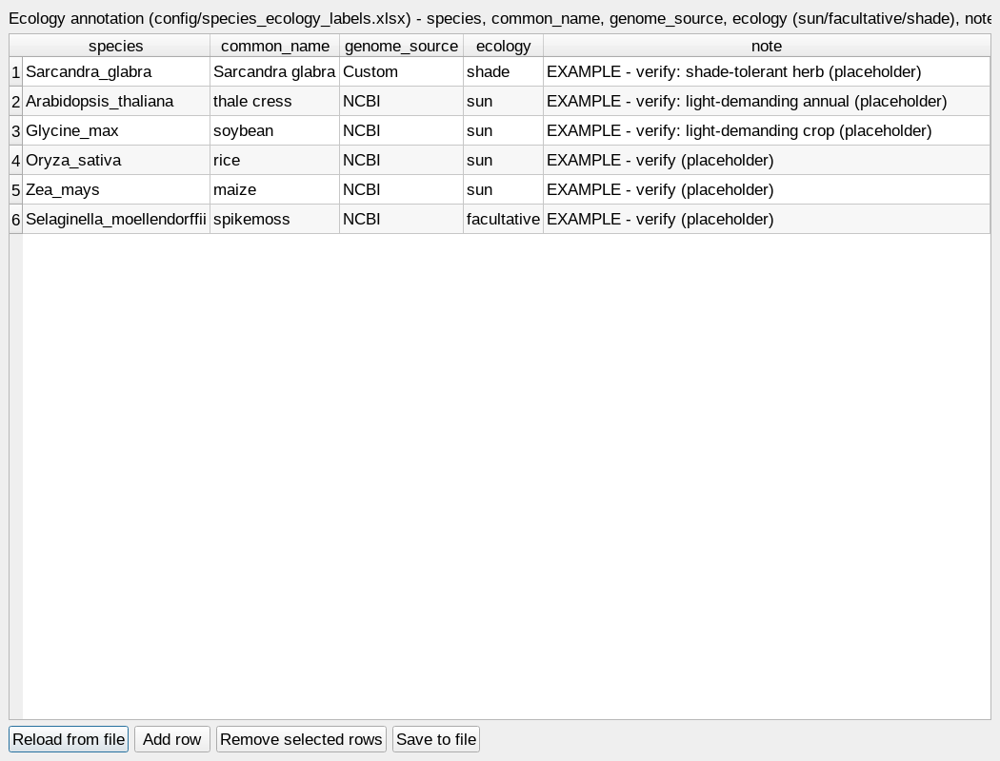
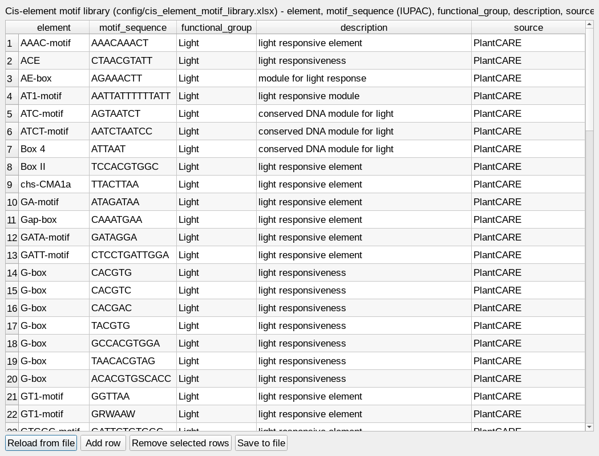

Screenshots
===========

This page walks through every part of the window, with a screenshot and a
short explanation for each.

Main window and sliding pages
-----------------------------

The window is organised as six sliding pages. Each analysis page runs the
matching pipeline scope and streams the full log live; **Run** starts it and
**Stop** interrupts it. The menu bar on top (File / Tools / Global / Help)
holds the parameter editor, the two XLSX table editors and the remaining
functions.

   The **Introduction** page: the workflow overview and the six pages of the
   window (Nuclear / Chloroplast / Mitochondrial / Label ecology / Compare
   ecology).

   The **Nuclear genome** page runs nuclear steps 01–06: NCBI species metadata
   and FASTA+GFF3 downloads (01–03, complete-safe with instant fail on dead
   URLs and bounded rate-limit probes), incremental promoter extraction (04),
   the NCBI + custom merge (05) and the universal cis-element scan (06).
   Results land under ``result/nuclear_genome/``.

   The **Chloroplast genome** page runs the same six steps for the chloroplast
   compartment; step 04 is circular-aware, so promoters can wrap across the
   replication origin. Results land under ``result/chloroplast_genome/``.

   The **Mitochondrial genome** page runs the same six steps for the
   mitochondrial compartment. Results land under ``result/mitochondrial_genome/``.

   The **Label ecology** page (cross-genome step 06): assigns the
   ``sun`` / ``facultative`` / ``shade`` labels from
   ``config/species_ecology_labels.xlsx`` to the merged NCBI+custom datasets
   of all three genome types and writes
   ``result/ecology_compare/06_label_ecology/species_ecology_assignment.xlsx``
   (``Assignment`` / ``Group_counts`` / ``Unlabeled`` sheets) — the single
   label source for the comparison. Run it after the genome pages and before
   Compare ecology; re-run only this page after editing the label table.

   The **Compare ecology** page runs steps 07–09: merge the three datasets
   into the ecology master table (07), differential statistics —
   Kruskal-Wallis plus pairwise Wilcoxon with Benjamini-Hochberg correction
   (08) — and the publication figures (09). It requires the Label ecology page
   to have run first. Results land under ``result/ecology_compare/``.

Menu-bar popup windows
----------------------

The three parameter/table editors open as popups from the **Tools** menu.

   **Tools → Run pipeline…** — edit ``promoter_len``, ``workers``, ``cores``,
   ``min_group_n`` and the optional NCBI API key, tick the parts to run, pick
   a scope (all / nuclear / chloroplast / mitochondrial / label_ecology /
   ecology) and start or stop the run. The same values are stored in
   ``quickstart_config.yml`` and are used by the command line identically.

   **Tools → Ecology labels…** — the table editor for
   ``config/species_ecology_labels.xlsx``: add or remove species, assign each
   species its ``sun`` / ``facultative`` / ``shade`` label, reload or save.
   Changes take effect after re-running the Label ecology page.

   **Tools → Motif library…** — the table editor for
   ``config/cis_element_motif_library.xlsx``: every CRE searched by the
   universal scan (06) with its IUPAC ``motif_sequence`` and
   ``functional_group`` classification (hormone / light / stress / development
   / core / …). Exact motifs use fixed-string counting, degenerate IUPAC
   motifs are searched as regular expressions.

Other windows and hints
-----------------------

* **File** — Save parameters, Open results folder (``result/``), Quit.
* **Global → Configuration** — the "Softwares checking and configuration"
  dialog, the same check the ``sunshadeCisseeker check`` command runs.
* **Help → About** — version, bundle path and attribution.

Every result mentioned above can also be produced headlessly with the command
line (``sunshadeCisseeker run <scope>``); the GUI and the CLI edit the same
configuration files and write the same outputs.
