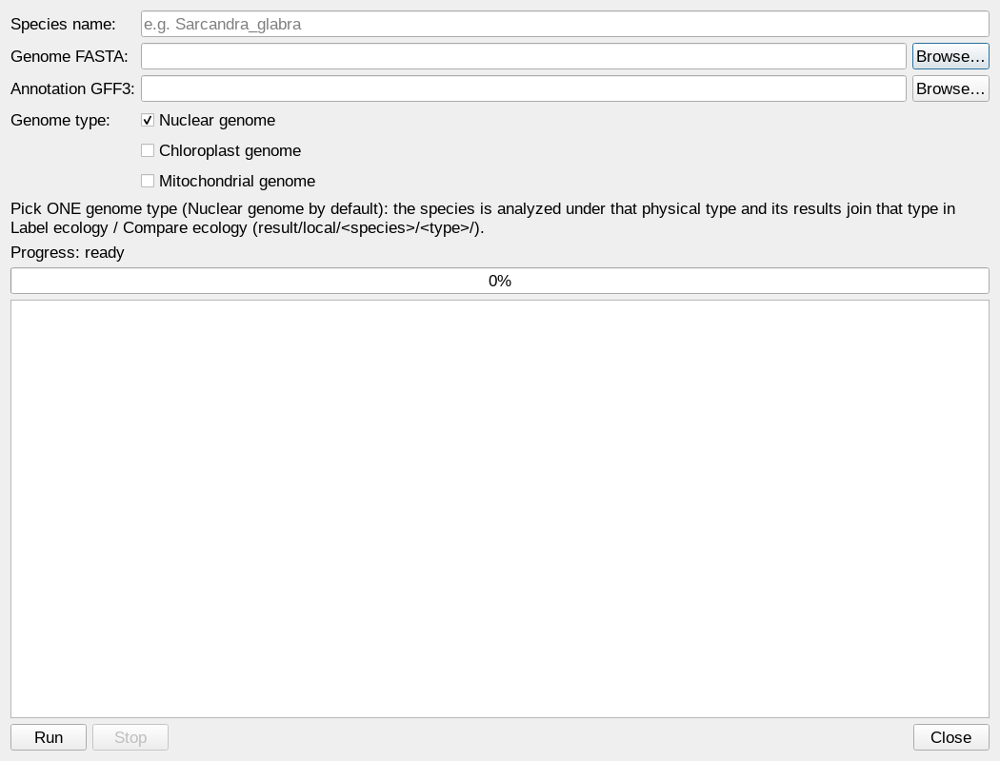
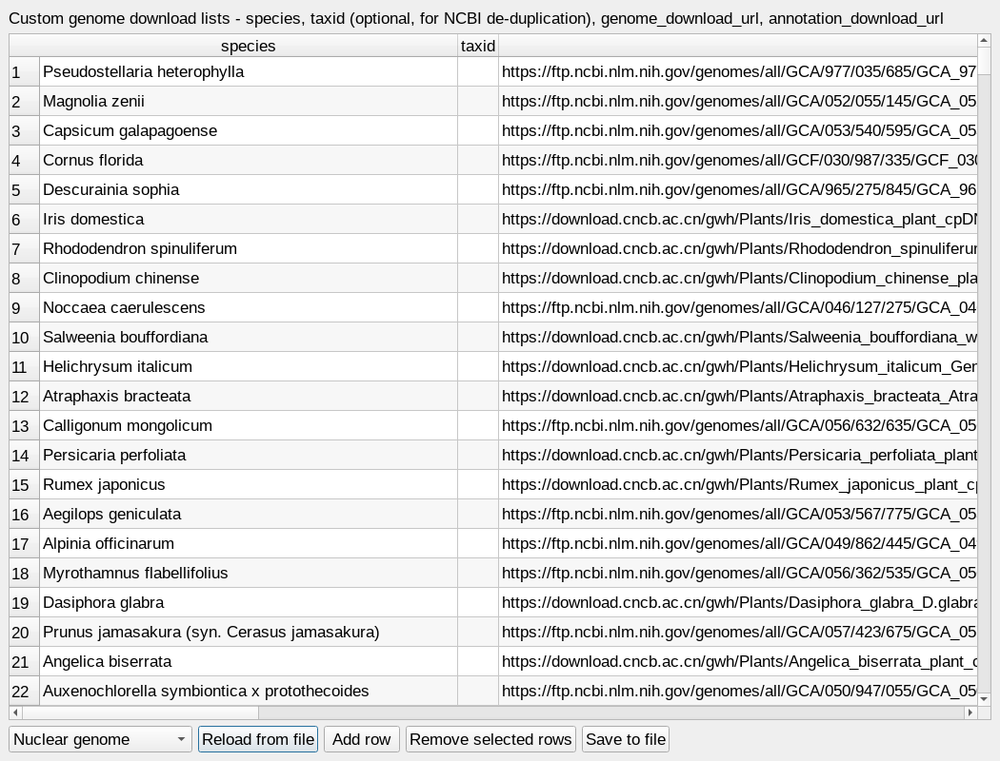

Screenshots
===========

This page walks through every part of the window, with a screenshot and a
short explanation for each.

Main window and sliding pages
-----------------------------

The window is organised as six sliding pages. Each analysis page runs the
matching pipeline scope and streams the full log live; **Run** starts it and
**Stop** interrupts it. A live progress bar above each log shows the overall
position (e.g. "Step 4/6 — promoter extraction — 46%"), and every started run
prints its run id as the first log line
(``run started | id=... | scope=...``) — each page tracks only its own run, so
several pages can run at the same time. The three genome pages additionally
have an **"NCBI API key (optional)" input** and a **"Max genome size (GB)"
input** next to Run/Stop (both write the matching ``quickstart_config.yml``
entries; the size cap skips genomes whose FASTA file exceeds that on-disk
size, default ``2``, empty = no limit). The menu bar on top
(File / Tools / Global / Help) holds the parameter editor, the single-species
**Run local** dialog, the **Custom genome lists** editor, the two XLSX table
editors and the remaining functions.

.. figure:: ../_static/screenshots/01-introduction.png
   :width: 1360

   The **Introduction** page: the workflow overview and the six pages of the
   window (Nuclear / Chloroplast / Mitochondrial / Label ecology / Compare
   ecology).

.. figure:: ../_static/screenshots/02-nuclear-genome.png
   :width: 1360

   The **Nuclear genome** page runs nuclear steps 01–06: NCBI species metadata
   and FASTA+GFF3 downloads (01–03, complete-safe with instant fail on dead
   URLs and bounded rate-limit probes), incremental promoter extraction (04),
   the NCBI + custom merge (05) and the universal cis-element scan (06).
   Results land under ``result/nuclear_genome/``.

.. figure:: ../_static/screenshots/03-chloroplast-genome.png
   :width: 1360

   The **Chloroplast genome** page runs the same six steps for the chloroplast
   compartment; step 04 is circular-aware, so promoters can wrap across the
   replication origin. Results land under ``result/chloroplast_genome/``.

.. figure:: ../_static/screenshots/04-mitochondrial-genome.png
   :width: 1360

   The **Mitochondrial genome** page runs the same six steps for the
   mitochondrial compartment. Results land under ``result/mitochondrial_genome/``.

.. figure:: ../_static/screenshots/05-label-ecology.png
   :width: 1360

   The **Label ecology** page (cross-genome step 06): assigns the
   ``sun`` / ``facultative`` / ``shade`` labels from
   ``config/species_ecology_labels.xlsx`` (one sheet per genome type:
   ``nuclear_genome`` / ``chloroplast_genome`` / ``mitochondrial_genome``
   and, since v1.4.0, an optional ``local_genome`` sheet for the Run-local
   species) to the merged NCBI+custom datasets and writes
   ``result/ecology_compare/06_label_ecology/species_ecology_assignment.xlsx``
   (``Assignment`` / ``Group_counts`` / ``Unlabeled`` sheets) — the single
   label source for the comparison. The **genome-type checkboxes** select
   which types get labeled (only **Nuclear genome** starts checked;
   unchecked types are skipped); **Local genome** additionally labels the
   species staged by Tools → Run local. Run it
   after the genome pages and before Compare ecology; re-run only this page
   after editing the label table.

.. figure:: ../_static/screenshots/06-compare-ecology.png
   :width: 1360

   The **Compare ecology** page runs steps 07–09: merge the selected genome
   datasets into the ecology master table (07), differential statistics —
   Kruskal-Wallis plus pairwise Wilcoxon with Benjamini-Hochberg correction
   (08) — and the publication figures (09). The genome-type checkboxes
   match the Label ecology page (only **Nuclear genome** starts checked):
   unchecked types are left out of the merge, and **Local genome** merges
   the Tools → Run local species as one extra group.
   It requires the Label ecology page to have run first. Results land under
   ``result/ecology_compare/``.

Menu-bar popup windows
----------------------

The three parameter/table editors open as popups from the **Tools** menu.

.. figure:: ../_static/screenshots/07-run-pipeline.png
   :width: 1040

   **Tools → Run pipeline…** — edit ``promoter_len``, ``workers``, ``cores``,
   ``min_group_n``, the **max genome size (GB)** cap (skip genomes whose
   FASTA file exceeds that on-disk size; empty = no limit) and the optional
   NCBI API key, tick the parts to run
   (nuclear / chloroplast / mitochondrial / ecology comparison, NCBI download
   steps, Custom genome download), pick a scope (all / nuclear / chloroplast
   / mitochondrial / custom / label_ecology / ecology) and start or stop the
   run. The same values are stored in ``quickstart_config.yml`` and are used
   by the command line identically.

.. figure:: ../_static/screenshots/08-ecology-labels.png
   :width: 1040

   **Tools → Ecology labels…** — the table editor for
   ``config/species_ecology_labels.xlsx``: the **Genome type sheet** combo
   picks the sheet to edit (``nuclear_genome`` / ``chloroplast_genome`` /
   ``mitochondrial_genome``); add or remove species, assign each species its
   ``sun`` / ``facultative`` / ``shade`` label, reload or save (saving
   preserves every other sheet; older single-sheet files load their first
   sheet). Changes take effect after re-running the Label ecology page.

.. figure:: ../_static/screenshots/09-motif-library.png
   :width: 1040

   **Tools → Motif library…** — the table editor for
   ``config/cis_element_motif_library.xlsx``: every CRE searched by the
   universal scan (06) with its IUPAC ``motif_sequence`` and
   ``functional_group`` classification (hormone / light / stress / development
   / core / …). On Linux the scan runs the bundled C++ Aho-Corasick backend
   (``bin/cre_scan``); motifs are matched as literal fixed text, and an R
   ``stringi`` fallback covers hosts without the binary.

   **Tools → Run local…** — analyze ONE species from a local FASTA + GFF3 in
   an isolated workspace: enter the species name, pick the two files, tick
   the genome type(s) (nuclear / chloroplast / mitochondrial) and press Run.
   The files are snapshot-copied to ``result/local/<species>/input/`` and
   every 04–06 output lands under ``result/local/<species>/<type>_genome/``
   with the standard file names and column layouts (the shared
   ``result/<type>`` trees, the NCBI task lists and the custom set are never
   touched); ticked types run one after another and Stop interrupts the
   queue.

   **Tools → Custom genome lists…** — the table editor for the three per-type
   custom download lists (``Custom_genome_fa_gff/<type>/Custom_genome_fa_gff_<type>.xlsx``,
   ``download_list`` sheet): ``species``, ``taxid`` (optional NCBI taxonomy id
   for the species de-duplication; step 01 fills it in automatically), and
   the two download URL columns. The selector at the top switches between
   the nuclear / chloroplast / mitochondrial lists; Save preserves the
   workbook's README sheet and keeps a ``.bak``.

Other windows and hints
-----------------------

* **File** — Save parameters, Open results folder (``result/``), Quit.
* **Global → Configuration** — the "Softwares checking and configuration"
  dialog, the same check the ``sunshadeCisseeker check`` command runs.
* **Help → About** — version, bundle path and attribution.

Every result mentioned above can also be produced headlessly with the command
line (``sunshadeCisseeker run <scope>``); the GUI and the CLI edit the same
configuration files and write the same outputs.
